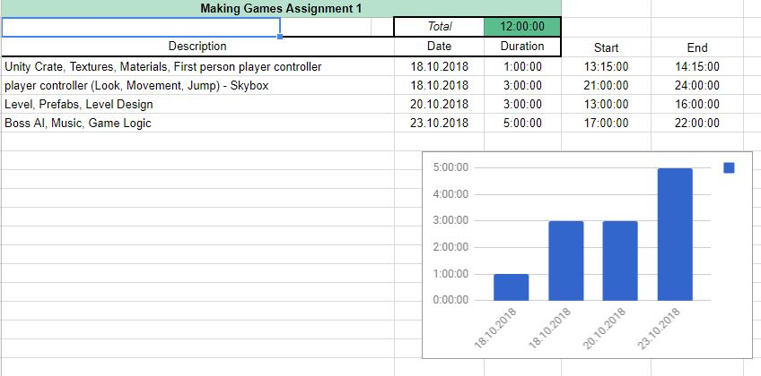

# FPSBossTypeDanger

## Controls
- [W A S D / arrow keys							|	move player
- mice to look									| 	aim
- spacebar										|	jump
- C 											|   duck
- LeftShift										|   run
- Mouse1										|	fire

## Gameplay Features
- feature A
- feature B
- ...

## Technical Features (Unity and other)
- feature A
- feature B
- ...

## Time Spent report

## Problems and Challenges

## Resources, Sources, References and Links
Links to all resources, sources you are using. Don't try to reinvent the wheel and be smart about what you build and what you use from others, but never forget to document it accordingly. If you use something and don't document it, its plagiarism!

## Self Assessment
 - working game build, overall impression, is it a game?: 5
 - project structure: 5
 - documentation: 5s
 - features: (5)
    - Materials: 1
    - Light: 1
    - Particles: 1
    - Audio: 1
    - Input: 1

